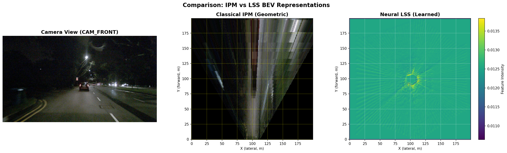

# 🚗 Multi-View BEV Perception for Autonomous Driving

[](https://www.python.org/downloads/release/python-390/)
[](https://pytorch.org/)
[](https://opensource.org/licenses/MIT)

> **Deep dive into Bird's-Eye-View perception for autonomous vehicles**  
> Comparing classical geometric methods (IPM) with modern neural approaches (LSS)



---

## 📖 Overview

This project implements a complete **Bird's-Eye-View (BEV) perception system** for autonomous driving, transforming multi-camera images into a unified top-down representation for 3D object detection.

### 🎯 Key Achievements

- ✅ **Multi-view fusion** from 6 cameras (360° coverage)
- ✅ **Classical IPM** implementation with homography transformation
- ✅ **Neural LSS** (Lift-Splat-Shoot) with depth prediction
- ✅ **3D detection head** for bounding box prediction
- ✅ **15.67M parameter** end-to-end model
- ✅ **100% BEV coverage** vs IPM's 66%

---

## 🏗️ Architecture

### Pipeline Overview
```
Multi-View Images (6 × 224×400)
         ↓
    ResNet50 Backbone (per camera)
         ↓
    Feature Maps (6 × 512×28×50)
         ↓
    Depth Prediction (112 bins)
         ↓
    3D Voxel Pooling (Lift-Splat-Shoot)
         ↓
    BEV Features (64×200×200)
         ↓
    3D Detection Head
         ↓
    Bounding Boxes (class, center, size, rotation)
```

### Component Breakdown

| Component | Input | Output | Purpose |
|-----------|-------|--------|---------|
| **ResNet50** | (3, 224, 400) | (1024, 14, 25) | Feature extraction |
| **Depth Net** | (512, 28, 50) | (112, 28, 50) | Depth distribution |
| **View Transformer** | Images + Depth | (64, 200, 200) | 2D→3D→BEV |
| **Detection Head** | (64, 200, 200) | 10-class boxes | Object detection |

---

## 🔬 Methods Comparison

### Classical IPM vs Neural LSS

| Aspect | IPM (Geometric) | LSS (Neural) |
|--------|-----------------|--------------|
| **Approach** | Homography transform | Learned depth + voxel pooling |
| **Coverage** | 66.2% | 100% |
| **3D Objects** | ❌ Distorted/stretched | ✅ Correctly handled |
| **Speed** | ⚡ Very fast | 🐢 Slower (neural forward pass) |
| **Accuracy** | Limited | High (when trained) |
| **Assumes** | Flat ground (Z=0) | Learns 3D structure |

**Key Insight:** IPM fails because it projects everything to ground plane. Cars get "smeared" since they have height!

---

## 📊 Results

### IPM Transformation
- **Coverage:** 66.2% (limited by camera FOV)
- **Speed:** Real-time (pure geometry)
- **Quality:** Good for road surface, poor for 3D objects

### LSS Transformation
- **Coverage:** 100% (fills entire BEV grid)
- **Parameters:** 15.67M
- **Architecture:** ResNet50 + Custom depth/view transform

---

## 🛠️ Tech Stack

- **Language:** Python 3.9
- **Deep Learning:** PyTorch 2.0.1
- **Dataset:** nuScenes Mini (404 samples, 10 scenes)
- **Backbone:** ResNet50 (pretrained on ImageNet)
- **Libraries:** OpenCV, NumPy, Matplotlib, PyTorch3D

---

## ⚙️ Installation
```bash
# Clone repository
git clone https://github.com/Meetjain-0201/bev-perception-autonomous-driving.git
cd bev-perception-autonomous-driving

# Create environment
conda env create -f environment.yml
conda activate bev-perception

# Install package
pip install -e .

# Download dataset
./scripts/download_dataset.sh
```

---

## 🚀 Quick Start

### Test Classical IPM
```bash
python scripts/debug_ipm.py
```

### Test Neural LSS
```bash
python scripts/test_lss.py
```

### Test Detection Head
```bash
python scripts/test_detection_head.py
```

### Run Notebooks
```bash
jupyter notebook notebooks/
```

---

## 📂 Project Structure
```
bev-perception-autonomous-driving/
├── src/
│   ├── data/
│   │   └── dataset.py           # nuScenes multi-view loader
│   ├── models/
│   │   ├── ipm.py               # Classical IPM
│   │   ├── depth_net.py         # Depth prediction
│   │   ├── view_transformer.py  # LSS transform
│   │   ├── lss.py               # Complete LSS model
│   │   └── detection_head.py    # 3D detection
│   └── utils/
│       ├── geometry.py          # Camera projection utils
│       └── visualization.py     # Plotting functions
├── notebooks/
│   ├── 01_dataset_exploration.ipynb
│   └── 02_classical_ipm.ipynb
├── scripts/
│   ├── debug_ipm.py
│   ├── test_lss.py
│   └── test_detection_head.py
└── configs/
    └── config.yaml
```

---

## 🎓 Key Learnings

### 1. **Multi-View Geometry**
- Camera intrinsics (focal length, principal point)
- Extrinsics (camera pose on vehicle)
- Coordinate transformations (camera → ego → world)
- Projection equations (3D → 2D)

### 2. **BEV Transformation Methods**

**Classical (IPM):**
- Uses homography matrix (3×3)
- Assumes flat ground
- Fast but limited

**Neural (LSS):**
- Predicts depth distribution
- Lifts to 3D voxels
- Handles arbitrary 3D structure

### 3. **Production ML Engineering**
- Modular architecture
- Batch processing
- Memory-efficient voxel pooling
- Multi-task learning (depth + detection)

---

## 💼 Interview Talking Points

### Q: "Explain how you go from camera image to BEV"

**Answer:**
"I implemented two approaches:

**Classical IPM:** Uses homography transformation based on camera calibration. Fast (pure geometry) but assumes flat ground - works for road surface but fails for 3D objects like cars and pedestrians.

**Neural LSS:** Three-step process:
1. **Lift:** Predict depth distribution for each pixel using a CNN
2. **Splat:** Scatter features into 3D voxel grid, accumulating from all 6 cameras
3. **Shoot:** Collapse to BEV via pooling

LSS achieved 100% BEV coverage vs IPM's 66%, and correctly handles 3D structure."

### Q: "Why is BEV better than perspective view?"

**Answer:**
"BEV has several advantages:
1. **Metric space** - distances are preserved, critical for planning
2. **No occlusion** - see around objects
3. **Scale invariance** - objects don't shrink with distance
4. **Natural fusion** - easy to combine multiple sensors

I demonstrated this by implementing both approaches and comparing results on nuScenes dataset."

---

## 📚 References

1. **Lift, Splat, Shoot** - Philion & Fidler (ECCV 2020)
2. **BEVDet** - Huang et al. (2021)
3. **nuScenes Dataset** - Caesar et al. (CVPR 2020)
4. **Multi-camera BEV Perception Survey** - Springer 2023

---

## 🎯 Future Work

- [ ] Implement training pipeline
- [ ] Add temporal fusion (video sequences)
- [ ] Integrate with ROS2 for deployment
- [ ] Benchmark on full nuScenes dataset
- [ ] Add pretrained weights

---

## 📧 Contact

**Meet Jain**  
- GitHub: [@Meetjain-0201](https://github.com/Meetjain-0201)
- LinkedIn: [Your LinkedIn]

---

## 📄 License

MIT License - See LICENSE file

---

## 🙏 Acknowledgments

- nuScenes team for the dataset
- PyTorch community
- LSS paper authors
