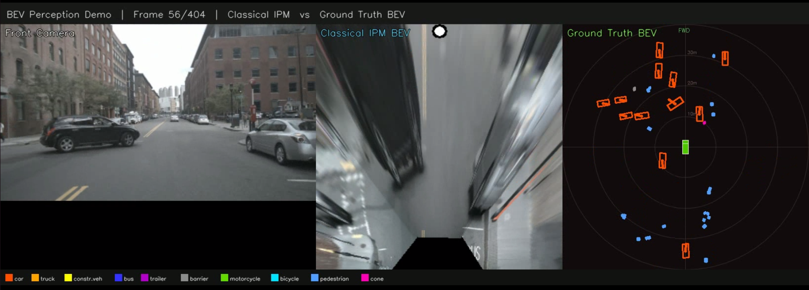
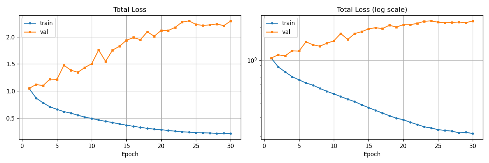

# BEV Perception for Autonomous Driving
**Classical IPM vs Neural Lift-Splat-Shoot on nuScenes**

---

## What This Is

Bird's Eye View (BEV) perception takes camera images from around a vehicle and produces a single unified top-down map — the natural representation for planning and control. This project implements and compares two fundamentally different approaches to that problem:

**Classical IPM** assumes the ground is flat and uses known camera geometry to directly project image pixels onto a BEV grid. No learning required — just the camera calibration from nuScenes. We stitch all 6 cameras into a single top-down image using alpha blending at overlap regions.

**Neural LSS (Lift-Splat-Shoot)** treats depth as uncertain and learns a distribution over 41 discrete depth bins per pixel. For each camera, features are lifted into a 3D frustum using these predicted depth weights, then splatted into a shared BEV voxel grid via scatter pooling. A detection head runs on the resulting 200×200 BEV feature map to predict class, position, dimensions, and orientation for each object.

The output is a side-by-side video: front camera | IPM road texture | ground truth annotated BEV.

---

## Results



**Training on nuScenes Mini (323 samples, 30 epochs, RTX 5060 8GB)**

| Metric | Value |
|---|---|
| Best val loss | 1.0486 |
| Train loss at epoch 30 | 0.213 |
| Time per epoch | ~42s |
| Total training time | ~21 min |



Training loss and validation loss broken down by component (classification, offset, dimensions, rotation).

---

## Architecture

```
6 camera images (1600x900, resized to 400x224)
        │
        ├──────────────── Classical IPM ─────────────────────────────►  BEV road texture
        │                 flat-ground projection, no parameters
        │
        └──────────────── LSS Pipeline ──────────────────────────────►  BEV detection map
                          │
                    ImageEncoder
                    ResNet50 (pretrained) + 1x1 neck
                    output: (B*6, 512, H/32, W/32)
                          │
                    DepthNet
                    predicts softmax distribution over 41 depth bins (4-45m)
                    output: (B*6, 41, H/32, W/32)
                          │
                    ViewTransformer  [Lift + Splat]
                    depth-weight features, unproject rays, scatter into voxels
                    output: (B, 512, 200, 200) BEV feature map
                          │
                    BEVEncoder
                    2x Conv-BN-ReLU
                    output: (B, 64, 200, 200)
                          │
                    DetectionHead (4 parallel heads)
                    ├── classification  (10 classes)
                    ├── center offset   (dx, dy)
                    ├── dimensions      (l, w via exp activation)
                    └── rotation        (sin θ, cos θ)
```

### IPM vs LSS

| | Classical IPM | Neural LSS |
|---|---|---|
| Learnable parameters | None | ~25M |
| Depth handling | Flat ground assumption | 41-bin categorical distribution |
| 6-camera fusion | Alpha blend at overlaps | Implicit via scatter pooling |
| Output | Road texture (pixel colors) | Per-cell object predictions |
| Inference speed | ~8ms / frame | ~80ms / frame |
| Breaks when | Ground isn't flat | Training data is too small |

---

## Dataset

[nuScenes Mini](https://www.nuscenes.org/nuscenes#download) — 10 scenes, 404 keyframe samples, 18,538 annotations across 10 object categories. Six time-synchronized cameras per sample at 1600×900, covering a full 360° field of view.

```
data/nuscenes/
├── maps/
├── samples/        # raw camera images
├── sweeps/
└── v1.0-mini/      # annotations, calibration, metadata
```

Train/val split: 8 scenes train (~324 samples), 2 scenes val (~80 samples).

---

## Setup

**Requirements:** Ubuntu 22.04+, Python 3.10+, CUDA 11.8+, 8GB+ VRAM

```bash
git clone https://github.com/<your-username>/bev-perception-autonomous-driving
cd bev-perception-autonomous-driving

python -m venv venv
source venv/bin/activate

# Install PyTorch first — match your CUDA version:
# https://pytorch.org/get-started/locally/
pip install torch torchvision

pip install timm nuscenes-devkit opencv-python numpy scipy \
            matplotlib pyquaternion scikit-learn tqdm PyYAML shapely wandb
```

Download nuScenes Mini from [nuscenes.org](https://www.nuscenes.org/nuscenes#download) (free account required). Extract so the path is:
```
data/nuscenes/v1.0-mini/
```

---

## Running the Project

All commands run from the project root with the venv active.

**Verify the data loader:**
```bash
python -c "
from src.dataset import get_dataset
ds = get_dataset('train')
item = ds[0]
print('images:', item['images'].shape)   # (6, 3, 224, 400)
print('boxes: ', item['boxes'].shape)    # (N, 9)
"
```

**Test IPM and save a BEV image:**
```bash
python -c "
import cv2
from src.dataset import get_dataset
from src.ipm import ipm_stitch_all_cameras, bev_to_bgr
from src.utils import load_config

cfg  = load_config()
item = get_dataset('train', cfg)[0]
bev  = ipm_stitch_all_cameras(item['images'], item['intrinsics'], item['extrinsics'], cfg)
cv2.imwrite('results/images/ipm_test.png', bev_to_bgr(bev))
print('saved results/images/ipm_test.png')
"
```

**Quick training check (5 epochs):**
```bash
python scripts/train.py --epochs 5
```

**Full training (30 epochs, ~21 min on RTX 5060):**
```bash
python scripts/train.py
# or log to W&B:
python scripts/train.py --wandb
```

Checkpoints are saved to `checkpoints/best.pth` whenever validation loss improves. Loss curves are written to `results/images/loss_curves.png` after each epoch.

**Generate the demo video:**
```bash
python scripts/demo_video.py
# output: results/videos/bev_demo_linkedin.mp4
```

---

## Project Structure

```
├── configs/
│   └── default.yaml         # all hyperparameters
├── scripts/
│   ├── train.py             # training loop
│   └── demo_video.py        # video generation
├── src/
│   ├── dataset.py           # nuScenes loader and calibration parsing
│   ├── ipm.py               # vectorized IPM, 6-cam stitch
│   ├── lss_model.py         # full LSS model (encoder, depth, view transform, heads)
│   ├── loss.py              # focal loss + masked regression losses
│   └── utils.py             # config loader, helpers
├── checkpoints/
│   └── best.pth             # saved after training
└── results/
    ├── images/              # IPM outputs, loss curves
    └── videos/              # demo video
```

---

## Implementation Notes

A few non-obvious decisions worth documenting:

**Intrinsic scaling.** nuScenes calibration is given for 1600×900. When images are resized, focal lengths and principal point must scale accordingly (`K[0,:] *= W/1600`, `K[1,:] *= H/900`). Getting this wrong shifts all projections.

**Yaw via quaternion composition.** Converting the ego pose rotation matrix to a `pyquaternion.Quaternion` fails at float32 precision because `np.linalg.inv` produces a matrix that isn't perfectly orthogonal. The fix is to compose quaternions directly: `ego_q.inverse * rot_g`.

**Focal loss normalization.** On a 200×200 BEV grid with ~50 occupied cells, dividing the total focal loss by `num_pos` causes the negative term to blow up by a factor of ~800. Positive terms are normalized by `num_pos`; negative terms are normalized by the total number of elements.

**Mixed precision scatter.** Under `torch.autocast`, features are float16 but the voxel accumulator is float32. `scatter_add_` requires matching dtypes — cast the source before the call: `feat_v.to(voxel_flat.dtype)`.

---

## References

- Philion, J. & Fidler, S. *Lift, Splat, Shoot: Encoding Images from Arbitrary Camera Rigs by Implicitly Unprojecting to 3D.* ECCV 2020. [[paper]](https://arxiv.org/abs/2008.05711) [[code]](https://github.com/nv-tlabs/lift-splat-shoot)
- Caesar, H. et al. *nuScenes: A multimodal dataset for autonomous driving.* CVPR 2020. [[dataset]](https://www.nuscenes.org/)
- Yin, T. et al. *Center-based 3D Object Detection and Tracking.* CVPR 2021. (focal loss + offset head formulation)
